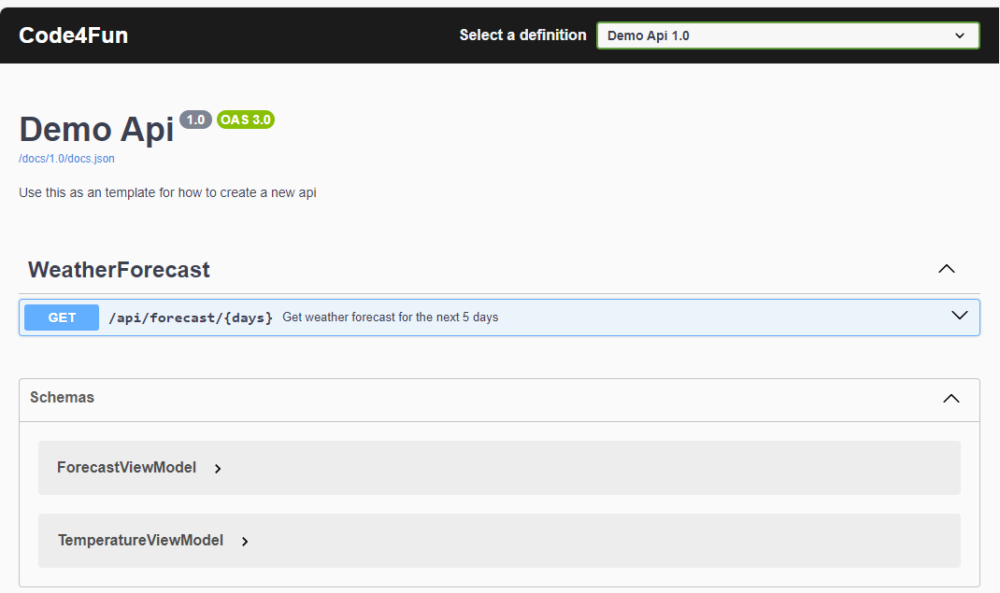

[](https://github.com/skarnes20/Kjetil.Demo.Api/actions/workflows/dotnet.yml)
[](https://sonarcloud.io/dashboard?id=kjetil-demo-api)

# Kjetil.Demo.Api
Example of how you can set up an web api with well defined arcitecture, unit testing and customized open api documentation

## Example of customized Open Api
Based on Swachbuckle so you ned to add 
```Powershell
Install-Package Swashbuckle.AspNetCore -Version 6.1.1
```
### Demonstrate
- Custom url (api/docs)
- Customized gui
- Enrich auto documentet controllers

#### How it looks


See the [a OpenApiInstaller](src/Kjetil.Demo.Api/Infrastructure/OpenApiInstaller.cs) for example code

## Use InMemory database to unit test your data access layer
- Look at [TestBaseDb](tests/Kjetil.Demo.DataAccess.UnitTest/Infrastructure/TestBaseDb.cs) to see how you can setup a testbase using InMemoryDb
- Look at [WeatherRepositoryTest](tests/Kjetil.Demo.DataAccess.UnitTest/Repositories/WeatherRepositoryTest.cs) to see how you easely can unit test your repository

## Use of Installers to have clean layers
- I keep my plumming code in the catalouge **Infrastructure**.
- I use **Installers** to have a clean setup and make sure that each layer keep hold of it's own dependencyes
- Example [DataAccessInstaller](src/Kjetil.Demo.DataAccess/Infrastructure/DataAccessInstaller.cs )
